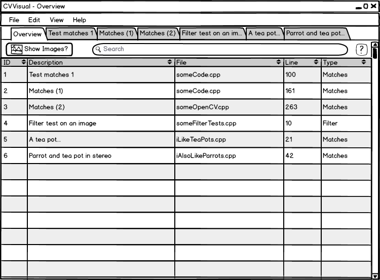
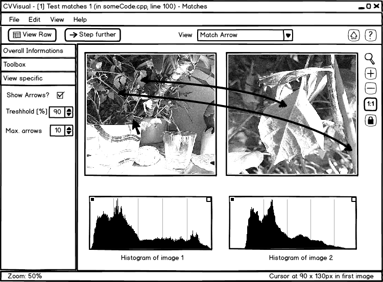

#Pflichtenheft CVVisual

##Einleitung
OpenCV ist ein im Jahre 1999 aus der Taufe gehobenes Projekt von Intel-Forschern.  
Es wurde im Jahre 2000 der breiteren Öffentlichkeit vorgestellt, 6 Jahre später erschien Version 1.0.  
Seitdem hat sich das Projekt stetig weiterentwickelt - es ist heute quasi der Standard unter den freien   
Bilderkennungs-Bibliotheken.
Es umfasst heutzutage Algorithmen für zum Beispiel einfache Bilderkennung, Gesichtserkennung,  
Bewegungsverfolgung und vieles mehr. Die Bibliothek ist auf Performance optimiert und findet auch  
deshalb heute Einsatz in vielen Bereichen, wie etwa der Augmented Reality auf mobilen Geräten  
oder an Universitäten.  

Wer jedoch damit arbeitet, steht zur Zeit noch vor einem Problem:  
Es existiert keine richtige Debug-Visualisierung für OpenCV. Das bedeutet, dass es augenblicklich  
keine Bibliothek (und auch kein Werkzeug) gibt, mit welchem man sich adäquat visualisieren lassen kann,  
was zum Beispiel eine lange Liste von Matches mit den zwei dazugehörigen Bildern zu tun hat,  
oder welche Auswirkung ein bestimmter Filter hat. Deswegen fangen Entwickler oft an, eigene  
Lösungen für dieses Problem zu entwickeln, die in der Hauptsache aus dem einfachen Speichern  
der Bilder oder der Verwendung primitiver Methoden von OpenCV  (wie etwa 'imshow()',  
das einfach nur ein Bild anzeigt) in Kombination mit schnell zusammengeschusterten Zeichenroutinen  
bestehen. Besonders für Neulinge stellt dieses weitestgehende Fehlen von Visualisierungsmöglichkeiten  
zu Debugzwecken eine große Hürde dar.  

Daran etwas zu ändern ist Ziel unserer Arbeit als PSE-Team an einer Open Source-Visualisierung für OpenCV.

##Produktfunktionen
Unser Produkt wird ein Debug-Werkzeug für diverse OpenCV-Funktionalität sein. Hierzu werden wir
die Ergebnisse von Filteroperationen verwenden, um die Auswirkungen des Filters auf das
Ursprungsbild zu visualisieren.

Um das Debuggen zu erleichtern und Codeänderungen im Anschluss überflüssig zu machen, werden wir die
Funktionalität dabei so implementieren, dass pro Translation Unit der Debug-Modus sowohl während
des Kompiliervorgangs als auch zur Laufzeit (de-)aktiviert werden kann. Bei der Deaktivierung während
des Kompilierens werden wir hierbei versuchen die Programmlaufzeit in keiner Weise negativ zu
beeinflussen.

Bei der Verwendung in Programmen mit mehreren Threads wird zwar mit eingeschränktem Komfort zu rechnen
sein, aber die prinzipielle Funktionalität an sich wird unbeeinträchtigt bleiben.

Zur Verwendung werden wir für die debugbaren OpenCV-Funktionalitäten Funktionen bereitstellen, welche
eine graphische Darstellung des Filters zu einem großen Debug-Hauptfenster hinzufügen werden (pro
Thread ein Hauptfenster).

Je nach View werden wir beispielsweise die Matches zwischen zwei Bildern mit Pfeilen darstellen.
Hierbei soll es auch eine Möglichkeit geben, die Darstellungen selbst zu filtern, beispielsweise indem
nur Pfeile zwischen Unterschieden, die einen gewissen Schwellwert überschreiten, gezeichnet werden.

##Produkteinsatz
Die Software soll zunächst im universitären Forschungsumfeld des beauftragenden Institutes eingesetzt
werden. Später kann der Nutzerkreis potentiell auf alle OpenCV Benutzer ausgedehnt werden, welche
OpenCV mit Qt Unterstützung kompiliert haben.

##Produktumgebung
Nach Möglichkeit alle Plattformen auf denen moderne Versionen von OpenCV und Qt5 laufen, sowie ein
C++11-Compiler.

##Funktionale Anforderungen

###API (Pflicht)
* __FA0100__: Globale Auswahl zwischen Debug und Release Modus
* __FA0200__: Auswahl der Visualisierung für jeden Operationstyp
* Unterstützung folgender Operationen:
	* [imgproc/Image Filtering](http://docs.opencv.org/modules/imgproc/doc/filtering.html): 
		* __FA0210__: [dilate (Dilatation)](http://docs.opencv.org/modules/imgproc/doc/filtering.html#dilate)
		* __FA0220__: [erode (Erosion)](http://docs.opencv.org/modules/imgproc/doc/filtering.html#erode)
		* __FA0230__: [morphologyEx](http://docs.opencv.org/modules/imgproc/doc/filtering.html#morphologyex)
		* __FA0240__: [Sobel](http://docs.opencv.org/modules/imgproc/doc/filtering.html#sobel)
	* [imgproc/Miscellaneous Image Transformations](http://docs.opencv.org/modules/imgproc/doc/miscellaneous_transformations.html): 
		* __FA0250__: [threshold](http://docs.opencv.org/modules/imgproc/doc/miscellaneous_transformations.html#threshold)
		* __FA0260__: [adaptiveThreshold](http://docs.opencv.org/modules/imgproc/doc/miscellaneous_transformations.html#adaptivethreshold)
		* __FA0270__: [floodFill (Ausfüllen)](http://docs.opencv.org/modules/imgproc/doc/miscellaneous_transformations.html#floodfill)
	* [feature2sd](http://docs.opencv.org/modules/features2d/doc/features2d.html): 
		* __FA0280__: [KeyPoint](http://docs.opencv.org/modules/features2d/doc/common_interfaces_of_feature_detectors.html#keypoint) 
		* __FA0290__: [DMatch](http://docs.opencv.org/modules/features2d/doc/common_interfaces_of_descriptor_matchers.html#dmatch)

###API (Optional)
* __FA0300__: Optionale Parameter für Einstellungen der Visualisierungen
* __FA0400__: Lokale Auswahl Debug/Release-Modus
* __FA0500__: Optionale nicht-blockierende Aufrufe für Streaming
* __FA0600__: Unterstützung folgender Operationen:
	* __FA0610__: imgproc/Histograms: [calcHist](http://docs.opencv.org/modules/imgproc/doc/histograms.html#calchist)
	* [imgproc/Feature Detection](http://docs.opencv.org/modules/imgproc/doc/feature_detection.html): 
		* __FA0620__: [Canny](http://docs.opencv.org/modules/imgproc/doc/feature_detection.html#canny)
		* __FA0630__: [HoughCircles](http://docs.opencv.org/modules/imgproc/doc/feature_detection.html#houghcircles)
	* __FA0640__: [stitching](http://docs.opencv.org/modules/stitching/doc/stitching.html)
	* __FA0650__: [ocl](http://docs.opencv.org/modules/ocl/doc/introduction.html) (OpenCL)

###GUI (Pflicht)
* __FA0700__: Eine Visualisierung pro oben gelisteter Operation (siehe API Kriterien)
* __FA0800__: Drei Visualisierungen für features2d/DMatch (drei der möglichen Wunsch-Visualisierungen, siehe unten)
* __FA0900__: Zoomfunktion

###GUI (Optional)
* __FA1000__: Permanente GUI mit Historie
* __FA1200__: Möglichkeit eine Filteroperation mit geänderten Parametern erneut anzuwenden
* __FA1300__: Hohe Zoomstufen mit Zusatzinformationen (z.B. Pixelwerte)
* __FA1400__: Optionale Ausnutzung von mehreren Bildschirmen durch Fenstermodus
* __FA1500__: Interaktive Überlagerung der Bilder durch Zusatzinformationen (Mouse over)
* __FA1600__: Flexibler Umgang mit unterschiedlichen Bildschirm- und Bildauflösungen
* __FA1700__: Suchleiste für alle Tabellen (z.B. jener der Übersichtsseite oder der Rohdatendatenanzeige)
* __FA1710__: Spezielle Syntax zum Beispiel zur Gruppierung von Datensätzen

###Mögliche Visualisierungen //TODO rewrite

####Allgemein
* __FA1800__: Darstellung von Rohdaten
	* Abmessungen der Bilder
	* Farbraum der Bilder (der in OpenCV genutzte Datentyp)
	* Tabellarische Darstellung, z.B. der Matches, mit Filtermöglichkeit
	* Diagramme (wie Histogramme)
* __FA1900__: Darstellung der Bilder nebeneinander

####Visualisierungen von Matches
* __FA2000__ Basisvisualisierung *(ähnlich [´drawMatches´](http://docs.opencv.org/modules/features2d/
doc/drawing_function_of_keypoints_and_matches.html?highlight=drawmatches#drawmatches))*
	* __FA2010__ Einzeichnen der Keypoints in die Bilder
	* __FA2020__ Verbinden der Matches durch Linien oder Pfeile
	* __FA2030__ Einfärben der Linien, Pfeile oder Punkte mit Falschfarben
	* __FA2040__ Ausblenden der Keypoints ohne Matches
	* __FA2050__ Auswahl von Matches anhand bestimmter Kriterien (z.B. via Histogramm)
	* __FA2060__ Manuelle Auswahl von Matches
	* __FA2070__ Automatische Zusammenfassung von Matches zu Gruppen
* __FA2100__: Projektionen
	* __FA2110__ Einzeichnen von Linien / Formen
	* __FA2120__ Auswählen von zugehörigen Matches
	* __FA2130__ Die Linien / Formen werden auf das zweite Bild projiziert
	* __FA2140__ Automatische Gruppierung der Matches zu Flächen
* __FA2200__: Darstellung von Punkttranslationen von einem Bild zum anderen mit Pfeilen
	* __FA2210__ Pfeillänge und Richtung entsprechen der jeweiligen Translation
* __FA2300__: Stereoskopische Darstellung als Tiefenbild
	* __FA2310__ Pixelfarbwerte entsprechen den jeweiligen Tiefenwerten

#### Visualisierungen für Filter
* __FA2400__: Differenzbilder
	* [u.A.](http://www.imagemagick.org/Usage/compare/#metrics%29)
* __FA2500__: Überlagerungen
* __FA2600__: Direkte Anwendung von Filtern auf ein oder zwei Bilder
	* Beispiel: Anwendung eines Kantenfilters um die Auswirkungen z.B. einer Kantenglättung zu visualisieren
* __FA2700__: Visualisierung über die Auswirkungen auf bestimmte Bildmetriken
	* z.B. Überlagerung von Histogrammen beider Bilder oder Vergleich der Kontrastwerte von bestimmten Bildbereichen

##Nichtfunktionale Anforderungen
###Produktleistungen (Pflicht)
* __NF0100__: Die GUI soll schnell starten und interaktiv bedienbar sein
* __NF0200__: Möglichst kein Overhead im Release-Modus.

###Produktleistungen (Optional)
* __NF0300__: Flexibler Umgang mit unterschiedlichen Bildschirm- und Bildauflösungen
* __NF0400__: Integration in das OpenCV Test Framework

###Qualitätsanforderungen (Pflicht)
* __NF0500__: Keine signifikanten Speicherlecks
* __NF0600__: Erweiterbarkeit um zusätzliche OpenCV Operationen und Visualisierungen
* __NF0700__: Modularer Aufbau (API und GUI)
* __NF0900__: Einhaltung der OpenCV und Qt Konventionen
* __NF1000__: Ausführliche Dokumentation der API und des GUI

###Qualitätsanforderungen (Optional)
* __NF1100__: Dokumentation des internen Codes mit Werkzeug
* __NF1200__: OpenCV geeigneter Aufbau des Build-Systems
* __NF1300__: Abdeckung durch Tests
* __NF1400__: Keine Resource-Leaks
* __NF1500__: Threadsafety (Im C++11-Modus)
* __NF1600__: Toleranz gegenüber fehlerhaften API-Aufrufen
* __NF1700__: Kein undefiniertes Verhalten

##Produktdaten
Rein aus der Konzeption unseres Projektes her, sind die meisten Produktdaten dem Typ der Dokumentation
zu zurechnen.

- __PD0100__: Handbuch:
	Es umfasst Erklärungen zur Benutzung der GUI, der einzelnen Visualisierungen und der Bibliothek.
	Des Weiteren sind ein Wegweiser zum Schnelleinstieg und Anleitungen zur Entwicklung von
	Erweiterungen des Projekts, insbesondere durch das Hinzufügen neuer Views, enthalten.
- __PD0200__: API- und Codedokumentation
- __PD0300__: FAQ
- __PD0400__: Einstellungen:
	Einstellungen der Übersichtsseite und der einzelnen Visualisierungen,
	welche vom Benutzer verändert wurden, sollen gespeichert werden.
- __PD0500__: Rohdaten:
	In vielen Views wird es möglich sein, die Rohdaten in einem gewünschten Format (z.B. CSV oder JSON) in einer Datei abzuspeichern.
- __PD0600__: Ursprungsbilder sowie Visualisierungen in Form von Schnappschüssen

##Systemmodell
* Das Interface wird aus öffentlichen Funktionen bestehen, die im Release-Modus nichts tun und im Debug-
	Modus, so gewünscht, die nicht-öffentlichen Debug-Methoden aufrufen.
* Die nichtöffentlichen Debug-Funktionen erzeugen eine graphische Visalisierung und fügen diese dem
	Thread-lokalen Hauptfenster hinzu.
* Die Bibliothek selbst wird über die Funktionen des öffentliche Userinterfaces angesteuert die
	lediglich prüfen ob der Debugmodus aktiv ist und gegebenenfalls die eigentlichen Funktionen im
	nichtöffentlichen, technischen Interface aufrufen.

##Bedienoberfläche

* Die Bedienoberfläche wird in Qt implementiert sein.
* Sie wird aus einem Hauptfenster pro Thread bestehen.
* Die verschiedenen Debug-Ansichten werden entweder im Hauptfenster oder in einzelnen Fenstern dargestellt.
* Daten von vorherigen API-Aufrufen werden auf einer Übersichtsseite tabellarisch dargestellt

###Skizzen //TODO write explanations

Übersichtseite mit Tabs und ohne Vorschaubildern.
Dem Benutzer kann mit Hilfe der Suchleiste in den vorhandenen Datensätzen zu suchen.

Übersichtseite mit Tabs und Vorschaubildern.

Übersichtseite mit Fenstern statt Tabs und Vorschaubildern.

Basisvisualisuerung eines Match-Datensatzes.

Unten in der Fensterleiste findet sich der aktuelle Zoomfaktor und die aktuelle Position in einem der beiden Bilder.
Wichtig: Die Position entspricht jener im gesamten Bild - nicht jener im angezeigten Ausschnitt.

Mit dem Button "View Raw" kann der Benutzer die Rohdatenanzeige für den aktuellen Datensatz anzeigen.
Der Button "Step further" wird angezeigt, sofern die zu debuggende Anwendung wegen dieser Visualisierung blockiert. Wobei damit
die Visualisierung nicht geschlossen wird.

Die View-Auswahl und die Zoom-Knöpfe am rechten Rand sind selbsterklärend. Bei Eindrücken des
Schlossknopfes versucht das Programm die Anzeigen beider Bilder zu synchronisieren.

Tabellarische Anzeige der Rohdaten, nach dem der Benutzer in der vorherigen Skizze auf den "View Raw"-Knopf gedrückt hat.

Dem Benutzer ist es wieder möglich mit Hilfe der Suchleiste in den Daten zu suchen und mit gedrückter STRG-Taste auch mehrere Einträge
zu markieren. Über das Kontextmenu ist es des Weiteren möglich entweder die ausgewählten Einträge in der Visualisierung hervorzuheben oder sie
als JSON oder CSV in die Zwischenablage zu kopieren.

Der Benutzer sieht bei einem hohen Zoomfaktor Zusatzinformationen im Bild, in diesem Fall die Werte für Rot, Grün, Blau für jedes einzelne Pixel.

Projektion einer automatischen Gruppierung von Matches von einem auf das andere Bild.
Hierbei wird jeweils das Histogramm des vom Benutzer ausgewählten Bereichs angezeigt. 

Darstellung von Punkttranslationen von einem Bild zum anderen mit Pfeilen.
Die Länge und Richtung des jeweiligen Pfeils entsprechen der Translation oder Verschiebung des Startpunktes im anderen Bild.

##Testfälle und Testszenarien

Unser Projekt ist eine reine Debug-Bibliothek, die es dem Benutzer möglichst einfach macht,
seine Bilddaten zu visualisieren. Deshalb enthält der Funktionsumfang im Grunde genommen nur
Visualisierungen und die meisten Testszenarios besitzen auf Grund dessen die folgende Struktur:

1. Der Programmierer schreibt den gewünschten API-Aufruf an die gewünschte Stelle in seinen Quelltext.
2. Ein Fenster öffnet sich und visualisiert die beim Aufruf übergebenen Daten.
3. Nun kann er mit der Visualisierung arbeiten, sie in den Einstellungen anpassen oder die
	Visualisierung wechseln.
4. Bei blockierenden Aufrufen klickt er nun auf einen Button, der das aufrufende Programm weiterlaufen
	lässt.
5. Er sucht entweder weiter Fehler in seinem Programm, oder sieht die angefallenen Datensätze in der
	Übersichtsseite durch und visualisiert die gewünschten.
7. Die Debugumgebung lässt sich ohne Fehler beenden.

###Tests für Filterview 
* __TF010__ Anzeige des Bildes/der Bilder
* __TF020__ Auswählen und wechseln der Filter
* __TF030__ Ändern der Parameter eines Filters
* __TF040__ Bedienung bei einem großen Bild und geringer Rechenleistung
* __TF050__ Benutzung mit mehr als einem Bild

###Tests für Matchview
* __TF060__ Anzeige des Bildes/der Bilder
* __TF070__ Auswählen und Wechseln von Views
* __TF080__ Sämtliche Buttons und Schieberegler testen
* __TF090__ Bedingung mit großen Bildern und mit geringer Rechenleistung

###Beispiel Ablauf
'cv::visualize::showMatches(inputImg1, inputImg2,matches);'
Dieser Code erzeugt ein Tab, im Hauptfenster, mit dem Standartview für Matches. Der View zeigt die Bilder nebeneinander an
und zeichnet zwischen den einzelnen Matches Pfeile. (BITTE LINK zu den enstprechenden Bild im Pflichtenhft einfügen)
Der Benutzer hat nun die Auswahl sich zusätliche Informationen anzeigen zu lassen, wie den "Matchwert" der einzelnen MAtches
durch einfärben der Pfeile in Falschfarben anzeigenzulassen, oder sich einen anderen View mit anderen Optionen zu wechsel,
in dem anderem View werden dieselben Bilder benutzt.
Auch hat er die Möglichkeit sich die "Rohdaten", wie die Werte der
einzelnen Matches (Koordinaten, Matchwert,..), anzeigen zu lassen. Für eine angenehmere Bedingung steht im eine Suchleiste mit 
einigen Befehlen zur verfügung, auch kann er die Liste nach den einzelnen Spalten sortieren.
Sollte die Matchanzeige zu unübersichtlich sein hat er auf der rechten seite Knöpfe zum Zoomen und auf der Linken Seite die
Möglichkeit Matches nach bestimmten Kriterien anzuzeigen bzw. auszublenden.
Nachdem der Benutzer, das GEwünschte gesehen hat, kann er, wenn es ein blockierender Aufruf war, den 'Stp further' Knöpf drücken
und sein Programm läuft weiter oder es war kein blockierender Aufruf, dann muss er auf den nächsten Aufruf warten oder
darauf das sein Programm sich beendet und sich das Debugfenster schliest.

##Abgrenzungskriterien
Unser Projekt grenzt sich durch existentes Design gegenüber „random code“ ab. Darüber hinaus ist uns
keine andere Lösung bekannt die Open Source ist, die mit unserer vergleichbare Ziele verfolgt.

Wichtig: Unser Projekt ist kein Stand-Alone-Programm und wird voraussichtlich keinen rückläufigen
Datenfluss unterstützen.

##Entwicklungsumgebung

###Quellcode
* GCC 4.8.0 oder neuer
* Qt 5
* C++11
* OpenCV 2.4.6 oder neuer
* GNU/Linux (besonders Ubuntu 12.04)
* CMake 8.2.7 oder neuer

###Dokumentation
Zur Dokumentation werden im wesentlichen die auch von OpenCV verwendeten Werkzeuge benutzt.
Die folgende Aufzählung wird im Verlauf des Projektentwicklung unter Umständen noch erweitert.
* SPHINX: Ein in Python geschriebenes Werkzeug mit dessen Hilfe das Handbuch und das FAQ geschrieben wird.
* Doxygen: Ein weitverbreitetes Werkzeug um aus den Kommentaren im Quelltext unseres Projektes eine übersichtliche Quelltextdokumentation zu erzeugen (vgl. Produktdaten). Es wird in Verbindung mit SPHINX verwendet.

##Lizenz
Unser Projekt ist OpenSource, weshalb jegliche Dokumentation und Quelllcode unter freien Lizenzen stehen.
Im folgenden werden nun kurz die Lizenzen für Dokumentation und Quelltext erläutert.

###Quellcode
Der Quelltext dieses Projektes steht in seiner Gesammtheit unter der BSD Clause 3 Lizenz, da auch OpenCV unter dieser Lizenz steht.
Die BSD Clause 3 Lizenz erlaubt es anderen Entwicklern den Quelltext unseres Projektes, wie auch dessen Binärformen, weiterzuverteilen und zu verändern,
solange der folgende Lizenzabschnitt im Programm selbst, dem Quelltext und der Dokumentation enthalten ist.
Außerdem ist es verboten, den Namen CVVisual oder die Namen der Mitentwickler zur Produktwerbung zu verwenden, ohne dass eine vorherige Erlaubnis eingeholt wurde.

	Copyright (c) 2013, CVVisual PSE Team
	All rights reserved.

	Redistribution and use in source and binary forms, with or without
	modification, are permitted provided that the following conditions are met:
		* Redistributions of source code must retain the above copyright
		   notice, this list of conditions and the following disclaimer.
		* Redistributions in binary form must reproduce the above copyright
		   notice, this list of conditions and the following disclaimer in the
		   documentation and/or other materials provided with the distribution.
		* Neither the name of the cvvisual project nor the
		   names of its contributors may be used to endorse or promote products
		   derived from this software without specific prior written permission.

	THIS SOFTWARE IS PROVIDED BY THE COPYRIGHT HOLDERS AND CONTRIBUTORS "AS IS" AND
	ANY EXPRESS OR IMPLIED WARRANTIES, INCLUDING, BUT NOT LIMITED TO, THE IMPLIED
	WARRANTIES OF MERCHANTABILITY AND FITNESS FOR A PARTICULAR PURPOSE ARE
	DISCLAIMED. IN NO EVENT SHALL THE CVVISUAL DEVELOPERS BE LIABLE FOR ANY
	DIRECT, INDIRECT, INCIDENTAL, SPECIAL, EXEMPLARY, OR CONSEQUENTIAL DAMAGES
	(INCLUDING, BUT NOT LIMITED TO, PROCUREMENT OF SUBSTITUTE GOODS OR SERVICES;
	LOSS OF USE, DATA, OR PROFITS; OR BUSINESS INTERRUPTION) HOWEVER CAUSED AND
	ON ANY THEORY OF LIABILITY, WHETHER IN CONTRACT, STRICT LIABILITY, OR TORT
	(INCLUDING NEGLIGENCE OR OTHERWISE) ARISING IN ANY WAY OUT OF THE USE OF THIS
	SOFTWARE, EVEN IF ADVISED OF THE POSSIBILITY OF SUCH DAMAGE.

Diese Lizenz hat außerdem, gegenüber z.B. der GNU GPL, den Vorteil, dass es auch eine Verwendung unseres Projektes
im Umfeld proprietärer Lizenzen erlaubt, und damit hoffentlich auch von Unternehmen genutzt werden kann.

###Dokumentation
Die Dokumentation, mit samt aller Bilder und Texte, steht unter der [CC-BY-SA Lizenz](https://creativecommons.org/licenses/by-sa/3.0/),
sofern nicht anders angegeben. 
Die Lizenz erlaubt es anderen die Dokumentation und Teile jener, zu kopieren und weiter zu verteilen, zu verändern und zu kommerziellen Zwecken
zu verwenden. Hierbei muss allerdings immer der Autor genannt werden und abgeleitete Werke müssen unter der selben, oder einer gleichwertigen,
Lizenz gestellt werden.

##Glossar
###Allgemein:
* API: Application Programming Interface. Eine Schnittstelle (s. Interface), über welche andere Programme 
	auf der Quelltextebene auf dahinter verborgene Funktionalität zugreifen können.

* Augmented Reality: "Erweiterung der Realität" durch einen Computer, etwa bei der Einblendung von
	Informationen in ein Bild der Umgebung, das auf einem Smartphone angezeigt wird.

* Bug: Fehlerhaftes Verhalten eines Programmes.
		
* Binärform: Hier das Programm in für den Computer direkt verwendbarer Form im Gegensatz zum
	Quellcode. Anders als dort ist hier kaum sichtbar, wie das Programm genau arbeitet,
	weshalb bei Open-Source-Projekten gerade der Quelltext offen liegt (vgl. Open Source).

* Datenstrom: Daten, die beispielsweise während der Ausführung eines Programms fließen, 
	wobei das Ende dieses Flusses nicht absehbar ist.

* Debug-Modus: Modus, bei dem zusätzliche Informationen angezeigt werden, um dem Programmierer das
	Auffinden und Beheben von Bugs (kurz Debugging oder Debuggen), hier insbesondere 
	Programmierfehlern, zu erleichtern. Vgl. Release-Modus.

* Debug-Visualisierung: Hier eine Visualisierung die den Benutzer beim Debuggen unterstützt, in dem sie relevante
	Daten zu den übergebenen Bildern anzeigt und diese damit leicht verständlich darstellt.

* FAQ: Engl. für "Häufig gestellte Fragen" enthält sie viele Fragen, die besonders neue Benutzer sich stellen, 
	wenn sie anfangen ein Projekt zu nutzen.

* Falschfarben: Verwendung von Farben ein einem Bild, die sich von den natürlichen, erwarteten Farben stark
	unterscheiden, um etwa Details hervorzuheben. 

* Filter: In der Bildverarbeitung die Veränderung eines Bildbereiches mithilfe eines bestimmten Algorithmus.

* freie Lizenz: Lizenz, die im Sinne der [Open Source Initiative](opensource.org), die Veränderung 
	und Weitergabe des unter ihr lizenzierten Inhalts ermöglicht.

* GNU: "GNU is Not Unix". Freies Betriebssystem und Software.

* GNU GPL: General Public License. Eine freie Software-Lizenz. Alle auf einer unter dieser Lizenz stehenden
	Software aufbauende Software steht ebenfalls unter dieser Lizenz.

* GNU/Linux: Das GNU-Betreibssystem in Kombination mit einem Linux-Kern.

* GNU-Projekt: Das Projekt zur Erstellung von GNU-Betriebssystem und Software.

* GUI: Graphical User Interface, zu deutsch Graphische Benutzeroberfläche. Stellt Funktionen graphisch dar,
	sodass der Benutzer beispielsweise per Mausklick damit interagieren kann; im Gegensatz zu
	textbasierten Benutzerschnittstellen. (Vgl. Interface).

* Interface: Schnittstelle. Ein Zugriffspunkt auf Funktionalitäten von außen, der einerseits den Zugriff 
	erleichtern und andererseits die eigentliche Funktionalität verbergen soll.

* Kompilieren: Umwandlung eines Quellcodes in eine für den Computer verständliche Form,
	mithilfe eines Kompiler genannten Programms.

* Matches: Durch OpenCV erzeugte Verknüpfungen zwischen zwei Bildbereichen bzw. Bildpixeln, 
	welche vom Benutzer an die API übergeben werden.

* Mouse over: Information über das Element einer GUI, auf dem der Mauszeiger ruht, wird angezeigt.

* Parallelrechner: Rechner, in dem mehrere Threads gleichzeitig nebeneinander ausgeführt werden können 
	(vgl. Thread).

* OpenCV Test Framework: Stellt Funktionen zum Testen zur Verfügung, etwa Überprüfungen,
	ob zwei Matrizen gleich sind.

* Open Source: Software, bei welcher der Quellcode frei zugänglich gemacht wird.
	Dies erlaubt unter anderem die Weiterverwendung und -entwicklung durch andere.
 
* Overhead: Zusätzlicher Speicher- oder Zeitaufwand.

* proprietär: In diesem Zusammenhang Software, die nicht unter einer freien Lizenz steht.

* Quellcode oder Quelltext: In einer Programmiersprache geschriebener Text, der zu einem 
	Computerprogramm umgewandelt werden kann. Vgl. auch Binärform.

* „random code“: Individueller Wegwerfcode der nur für eine einzige Probleminstanz hilfreich ist und
	sich meist durch nichtexistentes Design auszeichnet.

* Release-Modus: Veröffentlichungs-Modus, in dem keine zusätzlichen Debug-Informationen 
	angezeigt werden, also der Modus, in dem das fertige Programm läuft.

* Resource-Leak: Das Auftreten der Situation, dass Ressourcen irgendeiner Art (Speicher, Dateien, usw.) zwar
	alloziert werden, aber nach Verwendung nicht mehr an das System zurückgegeben werden.

* Rohdaten: Daten, die direkt und ohne wirkliche Aufarbeitung, aus den vom Entwickler beim API-Aufruf übergebenen Datenstrukturen stammen.

* Speicherleck: (engl. memory leak) Vgl. Resource-Leak; die Ressource ist in diesem Fall Speicher. 

* Stand-Alone-Programm: Programm, das für sich alleine funktioniert.

* Streaming: Hier das Weiterlaufen des Datenstroms.

* Tab: Hier ein registerkartenähnlicher Teil einer GUI.

* Thread: Ausführungsstrang in einem Programm. Der Begriff wird insbesondere im Zusammenhang mit
	Mehrfachkernsystemen, wo mehrere Threads gleichzeitig nebeneinander laufen können, 
	oft verwendet.

* thread-lokal: Auf einen Thread beschränkt (vgl. Thread).

* Threadsafety: Es ist sichergestellt, das mehrere Threads sich nicht gegenseitig stören, etwa
	beim Speichern von Daten.

* Translation Unit: Eine Einheit, die einzeln im Ganzen kompiliert wird (s. Kompilieren); ein Projekt teilt
	sich meist in mehrere solcher Einheiten auf.

* Undefiniertes Verhalten: Instruktionen deren Verwendung dazu führt, dass der C++-Standard *keinerlei*
	Verhaltensgarantien irgendeiner Art für das gesamte Programm mehr gibt. Etwas Umgangssprachlich:
	Der Standard untersagt die Verwendung.

* View: Zusammengehörige Visualisierungen eines bestimmten OpenCV-Features (oder einer Featureart).

###OpenCV:
* adaptiveThreshold: OpenCV-Methode, die mittels eines adaptiven threshold (s. unten) Graustufenbilder 
	in (u.U. invertierte) Binärbilder umwandeln kann.

* calcHist: Berechnet ein Histogramm.

* Canny: Kantenerkennung (mithilfe des Canny86-Algorithmus).

* Dilatation: Berechnung des Bereiches in einem Bild, der von einer Maske abgedeckt wird, wenn sich deren
	Bezugspunkt (oft der Mittelpunkt) durch den ganzen zu untersuchenden Bildbereich bewegt.

* DMatch: Klasse für das Matching (vgl. Matches)

* Erosion: Prüft, ob eine Maske, etwa eine geometrische Figur, vollständig in ein Bild 
	bzw. einen Bildbereich passt und gibt u.U. ein Bild zurück,
	 in dem nur die überdeckten Teile erhalten sind. 
	Bildet zusammen mit der Dilatation zwei der grundlegenden Bilverarbeitungsmethoden.

* floodFill: Bei dieser Methode wird ein zusammenhängender Bereich des Bildes 
	mit der übergebenen Farbe ausgefüllt.

* HoughCircles: Findet Kreise in einem Graustufenbild (unter Benutzung der Hough-Transformation).

* KeyPoint: Klasse, die Daten eines Punktes (Koordinaten, Nachbarschaftsgröße etc.) enthält.

* morphologyEx: diese Methode von OpenCV erlaubt fortgeschrittene morphologische Transformationen
	unter Benutzung und mehrfacher Anwendung von Dilatation und Erosion.

* ocl:  Das OCL-Modul stellt Implementierungen von OpenCV-Funktionalität für Geräte, 
	welche die Open Computing Language (kurz OpenCL), ein Interface über Parallelrechner, benutzen, 
	zur Verfügung.

* Sobel-Operator: Ein Kantenerkennungs-Filter.

* Stitching: Zusammenfügen mehrerer Bilder mit zusammenhängnden Bereichen an den Rändern 
	zu einem großen Bild, etwa von Einzelfotografien zu einem Panorama.

* threshold: Diese Methode eröffnet verschiedene Möglichkeiten, die Elemente eines Arrays auf ein 
	bestimmtes Niveau zu trimmen, auf binäre Werte herunterzubrechen und ähnliches.

##Literatur
- Technisches Schreiben -- (nicht nur) für Informatiker / Peter Rechenberg:
	Ein anschaulich und verständlich geschriebenes Buch, dass hilft den eigenen Schreibstil zu verbessern. Und damit die Verständlichkeit 
	der geschriebenen Dokumentation (vgl. Produktdaten) zu erhöhen.
- Designed for Use -- Create Usable Interfaces for Applications and the Web / Lukas Mathis:
	Die vorliegenden GUI-Entwürfe (vgl. Quarktasche) sind stark von diesem Buch beeinflusst, da es wichtige Techniken, Methoden und Denkmuster
	der UI-Entwicklung vermittelt. (Und das in einer für Informatiker verständlichen Sprache.)
