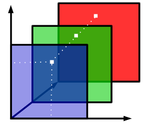
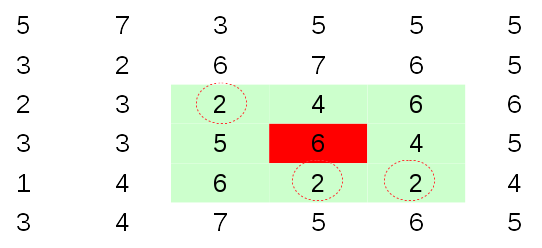
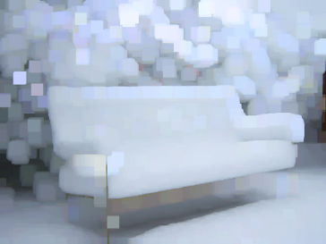
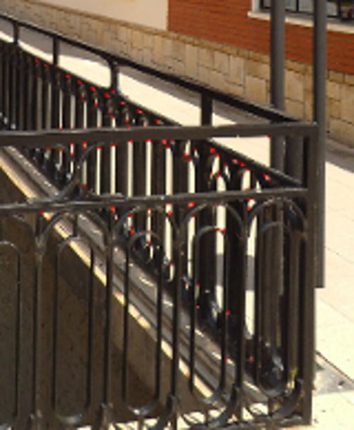
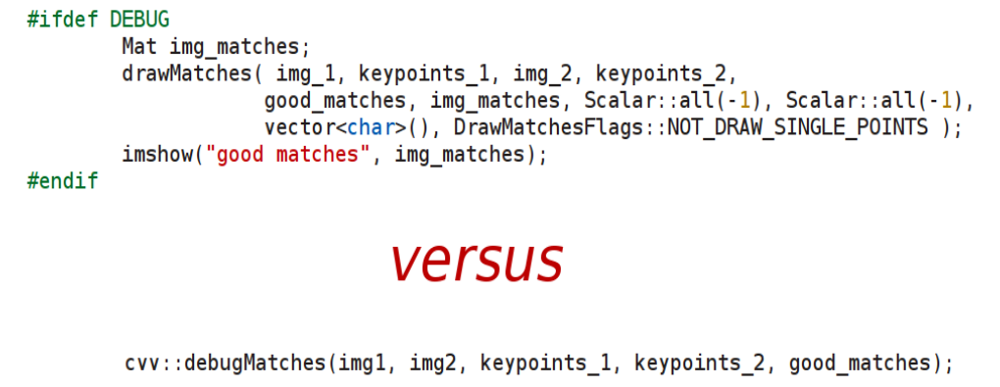
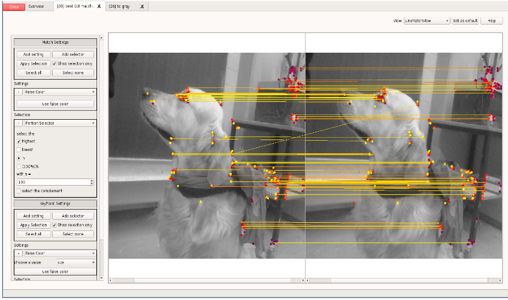
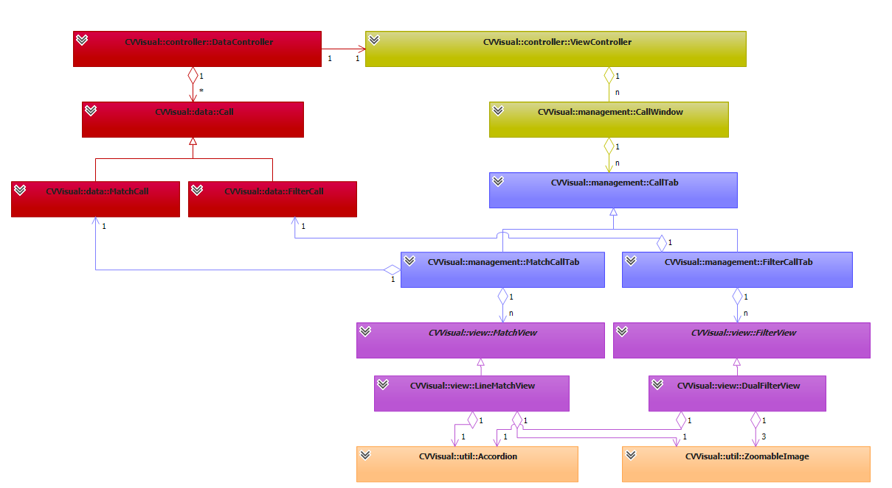

%CVVisual
%Andreas; Clara; Erich; Florian; Johannes; Nikolai; Raphael
%20. Juni 2014

Gliederung
----------

- Einführung in OpenCV <!--- Clara -->
- Motivation <!--- Andi-->
- Anwenderfeatures <!--- Raphael  -->
- Gui-Demo <!--- Johannes -->
- Architektur <!--- Erich -->
- Dokumentation <!--- Nikolai -->
- API<!--- Florian -->
- Ausblick

Einführung in OpenCV
====================

Überblick
---------

- Bildverarbeitung
- weite Verbreitung
- Matrizen als Grundlage
- Filter + Matches

Matrizen
--------

Bild = mehrdimensionale Matrix



<div class="notes">
Bsp. BGR-Bild: 1. Channel blau, 2. Channel grün usw.
</div>

Filter
------

Berechnung auf Umgebung jedes Pixels



Filter
------

Beispiel dilate: helle Flächen werden größer


Filter
------

Beispiel dilate: helle Flächen werden größer


Filter
------

Beispiel dilate: helle Flächen werden größer



Matches
-------

Keypoints = charakteristische Punkte



Matches
-------

Match = Paar aus Keypoints


Motivation
==========

Debuggen von OpenCV
-------------------

Systematisches Debugging statt „Random Code“



<div class="notes">
Hinweis auf showMatches/showKeypoints
</div>

Ziele
-----

Visualisierung von Matritzen, Filtereffekten und Matches



Anwenderfeatures
================

Verwendung
----------
<!---->

```cpp
std::string imgIdString = "imgRead" + toString(imgId);
cvv::showImage(imgRead, CVVISUAL_LOCATION, imgIdString);

// convert to grayscale:
cv::Mat imgGray;
cv::cvtColor(imgRead, imgGray, CV_BGR2GRAY);
cvv::debugFilter(imgRead, imgGray, CVVISUAL_LOCATION,
                 "to gray", "SingleFilterView");
```

Übersicht
---------
Übersicht über alle Aufrufe


Übersicht
---------
Filterbar


Übersicht
---------
Sortierbar


Übersicht
---------
Gruppierbar


Übersicht
---------


Filter
------
- 2 Bilder $\rightarrow$ 1 Bild
- Differenzbilder, Overlay, geänderte Pixel für Filter


Filter
------
- 1 Bild $\rightarrow$ 1 Bild
- Nachträgliche Anwendung weiterer Filter


Matches
-------
- Anzeigen / Filtern von Keypoints / Matches
- Anzeige der Verbindungen von Keypoints


Matches
-------
- Anzeigen / Filtern von Keypoints / Matches
- Anzeige der Translation von Keypoints


GUI-Demo
========

Architektur
===========

Entwurf
-------


Signals/Slots & Templates
-------------------------
```cpp
class SlotQString : public QObject
{	Q_OBJECT
public:
	SlotQString(const std::function<void(QString)> &f,QObject *parent = nullptr)
	    : QObject{ parent },function_{f}
	{	if (!f)
			throw std::invalid_argument{ "invalide function" };
	}
public slots:
	void slot(QString t) const
		{function_(t);}
	private:
	std::function<void(QString)> function_;
};
```

RegisterHelper
--------------
- Ermöglicht die Auswahl von Funktionen über eine Combobox
- Funktionen werden über eine API Funktione registriert
- Wird in der API Demo vorgestellt

```cpp
cvv::qtutil::registerMatchSettings<cvv::qtutil::SingleColorMatchPen>("Single Color");

template <class Setting>
bool registerMatchSettings(const QString &name)
{
	return MatchSettingsSelector::registerElement(
	    name, [](std::vector<cv::DMatch> univers)
	{
		    return std::unique_ptr<MatchSettings>{ new Setting{univers}};
	});
}
```

<!--- accordion??? -->
<!--- bisher nur view/qtutil ggf tabs/overview?-->

Dokumentation
=============

##Tutorials, Beispiele


##Kurzdokumentation 
Wird von der Hilfefunktion des Programms benutzt.


##Referenz:
* Mit Hilfe von Doxygen


API
===

Anwender API
------------

* Triviale Benutzung auch in C++98
* Sehr klein und übersichtlich


Interne API <!-- Florian: -->
-----------

* Erweiterung über Funktionen in `cvv::extend`
* Leichtes, zentralisiertes Hinzufügen von Visualisierungen, Filtern, Views,…

Ausblick
========

Rezeption
---------
Projekt schien von der OpenCV-Community wohlwollend aufgenommen zu werden


Rezeption
---------
Nach aktuellem Stand aber aufgrund C++11 und Qt5 keine Aufnahme ins Haupt-Repo


Links
-----
* Github: [https://github.com/CVVisualPSETeam/CVVisual/](https://github.com/CVVisualPSETeam/CVVisual/)
* Dokumentation: [https://cvv.mostlynerdless.de/](https://cvv.mostlynerdless.de/)
* Doxygen: [https://cvv.mostlynerdless.de/api/](https://cvv.mostlynerdless.de/api/)
