%CVVisual\
 Ein Debug-Framework für OpenCV
%Andreas; Clara; Erich; Florian; \
 Johannes; Nikolai; Raphael
%20. Juni 2014

Gliederung
----------

- Einführung in OpenCV <!--- Clara -->
- Motivation <!--- Andi-->
- Anwenderfeatures <!--- Raphael  -->
- Gui-Demo <!--- Johannes -->
- Dokumentation <!--- Nikolai -->
- Architektur <!--- Erich -->
- API + Demo <!--- Florian -->
- Ausblick (?)

Einführung in OpenCV
====================

Überblick
---------

- Bildverarbeitung
- weite Verbreitung
- Matrizen als Grundlage
- Filter + Matches (und vieles mehr!)

Matrizen
--------

- Bild = mehrdimensionale Matrix
- 3\. Dimension = Channel
//Bsp. BGR-Bild: 1. Channel blau, 2. Channel grün usw.

Filter
------

- 2D-Bilder
- Berechnung auf Umgebung jedes Pixels
- Bsp: dilate, erode, Sobel
//erode -> kleine Details weg

Matches
-------

- FeatureDetector $\rightarrow$ Keypoints = charakteristische Punkte
- Match = Paar aus Keypoints

Motivation
==========

Debuggen von OpenCV
-------------------

Systematisches Debugging statt „Random Code“
//Hinweis auf showMatches/showKeypoints

Ziele
-----

* Visualisierung von Matritzen, Filtereffekten und Matches

Anwenderfeatures
================

Verwendung
----------
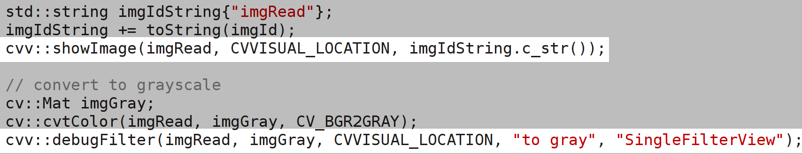

Übersicht
---------
Übersicht über alle Aufrufe
<!--- 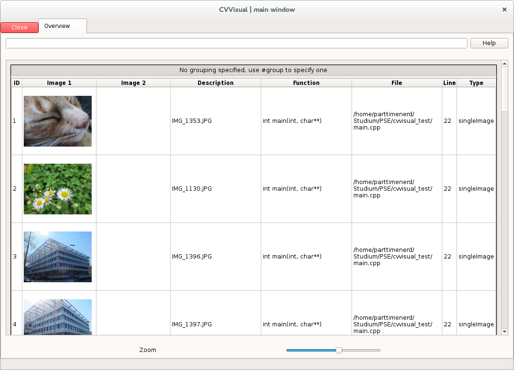 -->

Übersicht
---------
Filterbar
<!--- 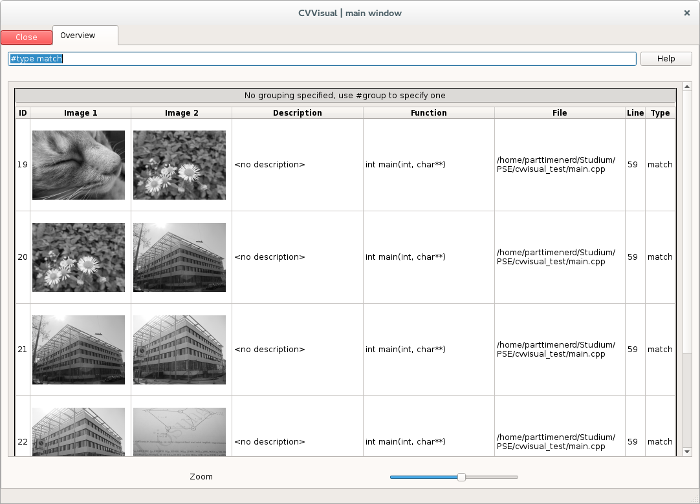 -->

Übersicht
---------
Sortierbar
<!--- 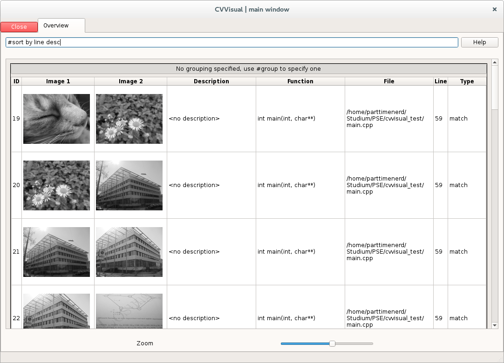 -->

Übersicht
---------
Gruppierbar
<!--- 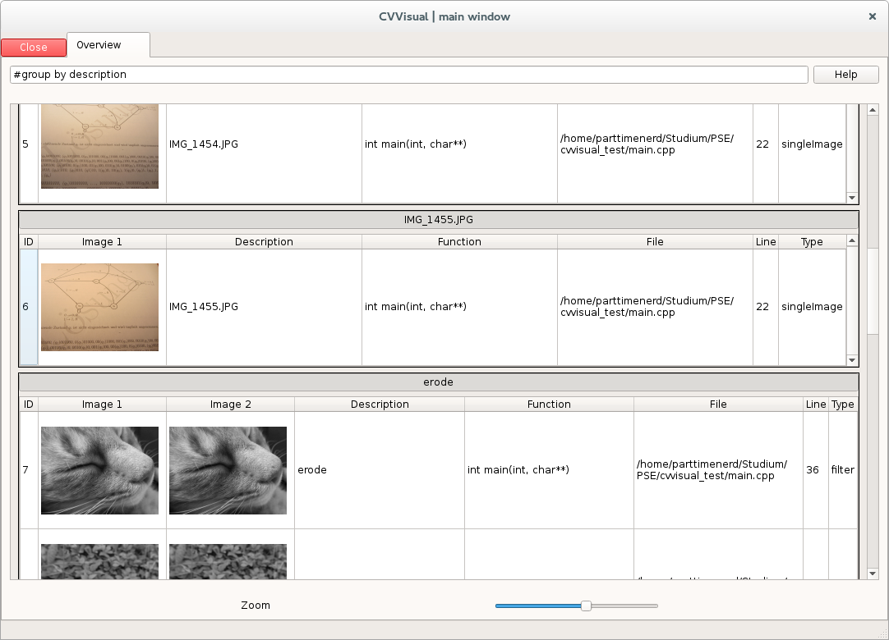 -->

Übersicht
---------
<!--- 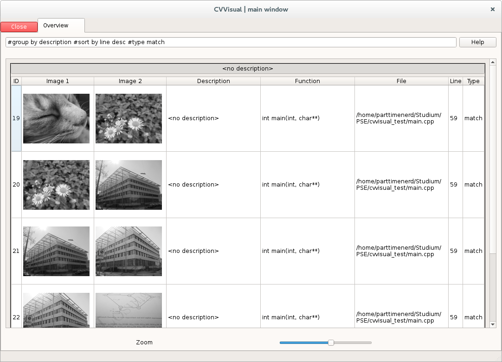 -->

Filter
------
- 2 Bilder $\rightarrow$ 1 Bild
- Differenzbilder, Overlay, geänderte Pixel für Filter
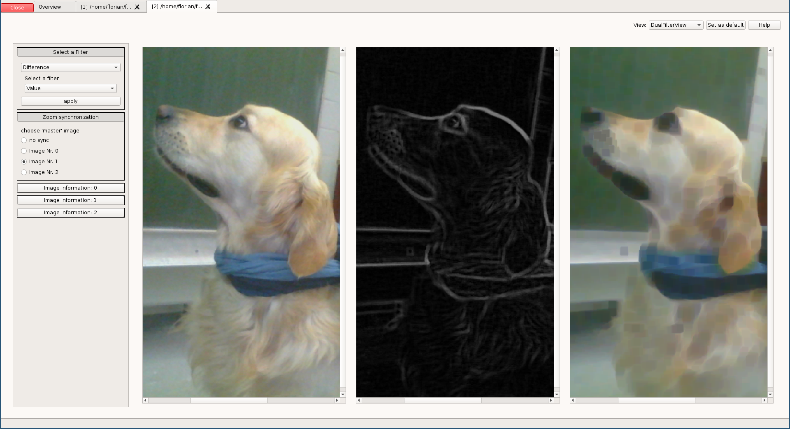

Filter
------
- 1 Bilder $\rightarrow$ 1 Bild
- Nachträgliche Anwendung weiterer Filter
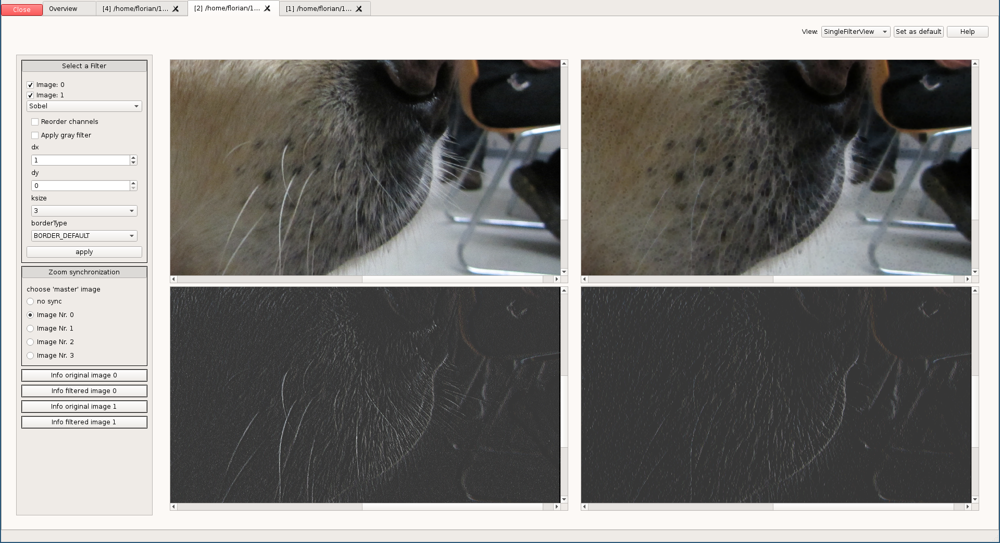

Matches
-------
- Anzeigen / Filtern von Keypoints / Matches
- Anzeige der Verbindungen von Keypoints
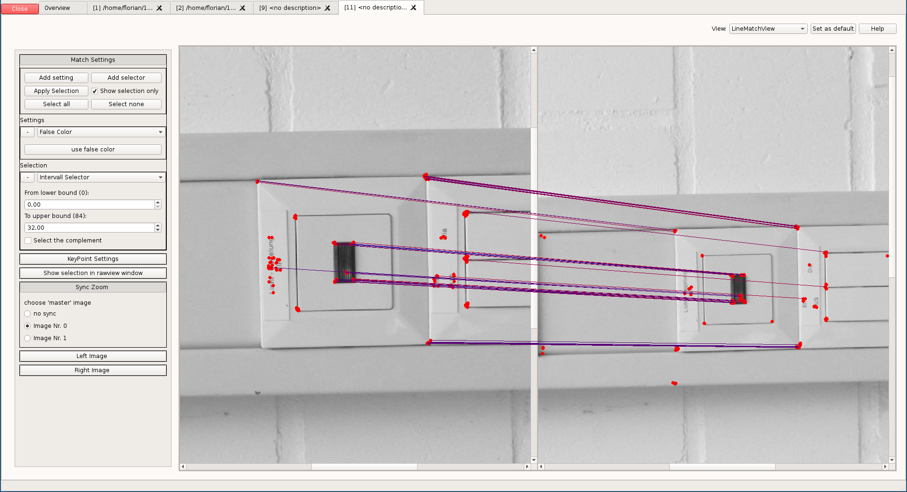

Matches
-------
- Anzeigen / Filtern von Keypoints / Matches
- Anzeige der Translation von Keypoints
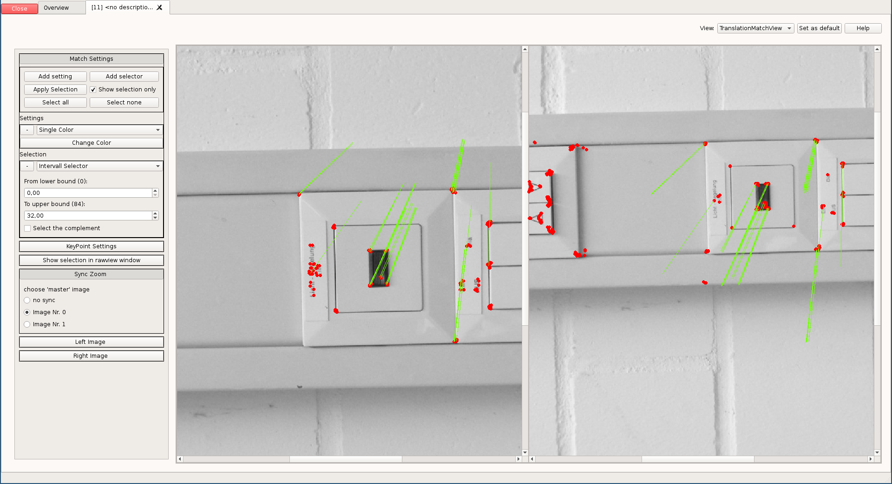

GUI-Demo
========

Dokumentation
=============

##Tutorials, Beispiele
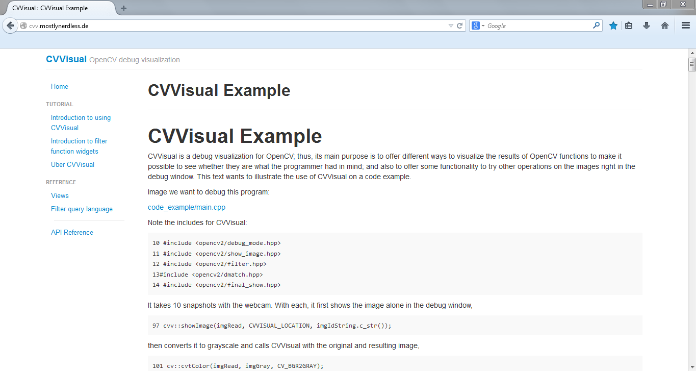

##Kurzdokumentation 
Wird von der Hilfefunktion des Programms benutzt.
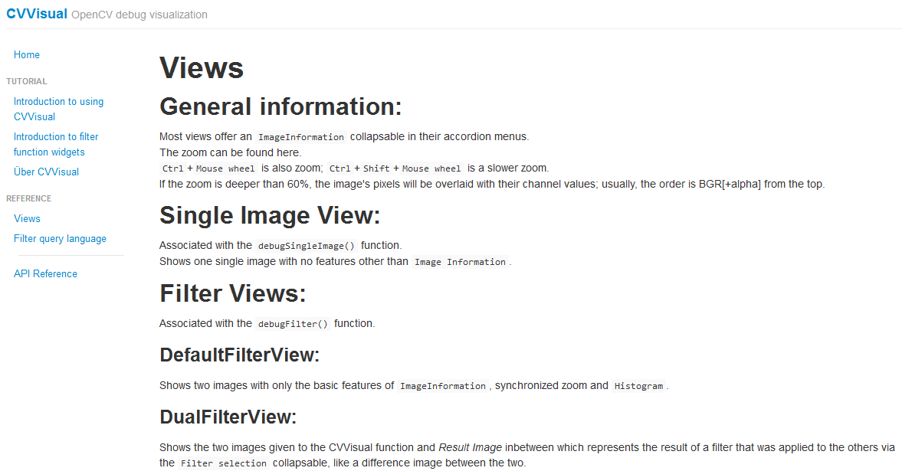

##Referenz:
* Mit Hilfe von Doxygen
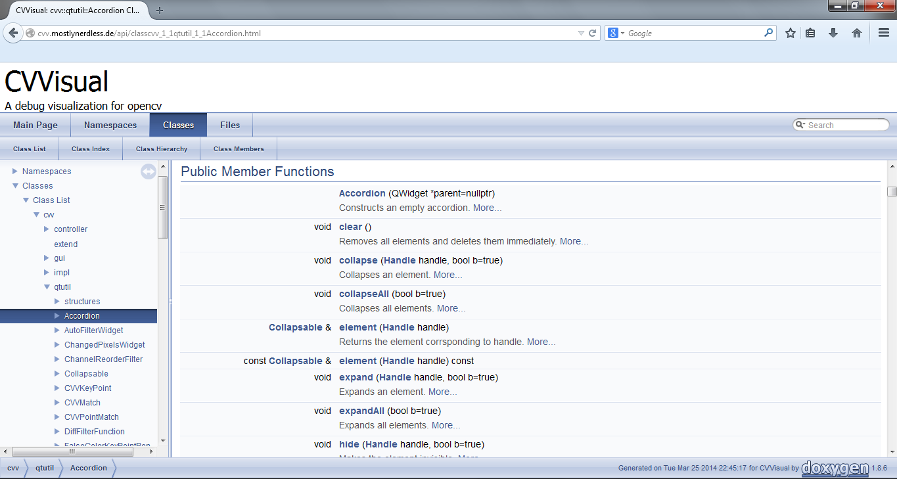

Arichtektur
===========

API
===

Anwender API
------------

* Triviale Benutzung auch in C++98
* Sehr klein und übersichtlich

Interne API
-----------

* Leichtes, zentralisiertes Hinzufügen von Visualisierungen, Filtern, …

Ausblick
========

Rezeption
---------
Projekt schien von der OpenCV-Community wohlwollend aufgenommen zu werden
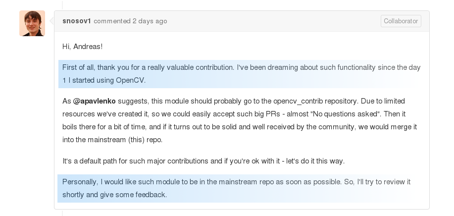

Rezeption
---------
Nach aktuellem Stand aber aufgrund C++11 und Qt5 keine Aufnahme ins Haupt-Repo
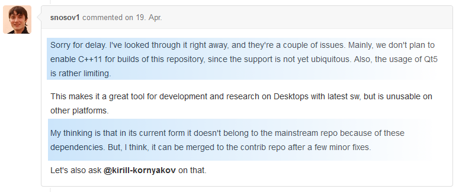

Links
-----
* Github: [https://github.com/CVVisualPSETeam/CVVisual](https://github.com/CVVisualPSETeam/CVVisual)
* Dokumentation: [https://cvv.mostlynerdless.de/](https://cvv.mostlynerdless.de/)
* Doxygen: [https://cvv.mostlynerdless.de/api/](https://cvv.mostlynerdless.de/api/)
