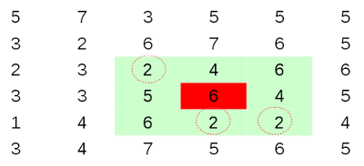
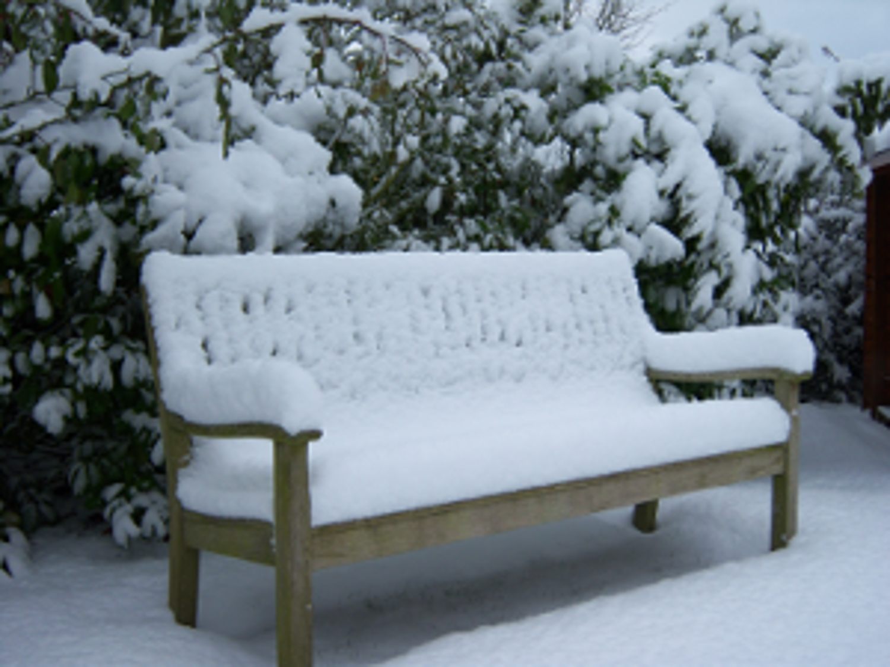
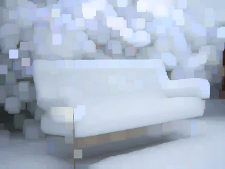
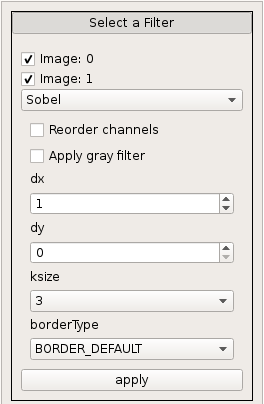
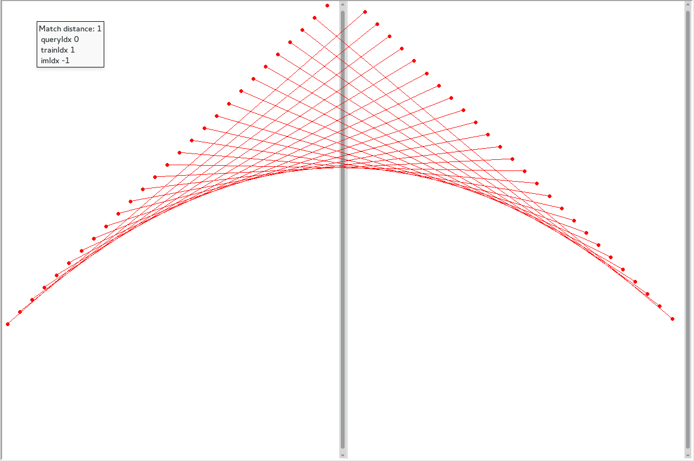
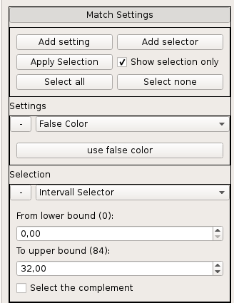

%CVVisual
%Andreas; Clara; Erich; Florian; Johannes; Nikolai; Raphael
%20. Juni 2014

Gliederung
----------

- Einführung in OpenCV <!--- Clara -->
- Motivation <!--- Andi-->
- Anwenderfeatures <!--- Raphael  -->
- Gui-Demo <!--- Johannes -->
- Dokumentation <!--- Nikolai -->
- Architektur <!--- Erich -->
- API<!--- Florian -->
- Ausblick

Einführung in OpenCV
====================

Überblick
---------

- Bildverarbeitung
- weite Verbreitung
- Matrizen als Grundlage
- Filter + Matches

Matrizen
--------

Bild = mehrdimensionale Matrix


<div class="notes">
Bsp. BGR-Bild: 1. Channel blau, 2. Channel grün usw.
</div>

Filter
------

Berechnung auf Umgebung jedes Pixels



Filter
------

Beispiel dilate: helle Flächen werden größer



Filter
------

Beispiel dilate: helle Flächen werden größer


Filter
------

Beispiel dilate: helle Flächen werden größer



Matches
-------

Keypoints = charakteristische Punkte


Matches
-------

Match = Paar aus Keypoints


Motivation
==========

Debuggen von OpenCV
-------------------

Systematisches Debugging statt „Random Code“


<div class="notes">
Hinweis auf showMatches/showKeypoints
</div>

Ziele
-----

Visualisierung von Matritzen, Filtereffekten und Matches


Anwenderfeatures
================

Verwendung
----------
<!---->

```cpp
std::string imgIdString{"imgRead"};
imgIDString += toString(imgId);
cvv::showImage(imgRead, CVVISUAL_LOCATION, imgIdString);

// convert to grayscale:
cv::Mat imgGray;
cv::cvtColor(imgRead, imgGray, CV_BGR2GRAY);
cvv::debugFilter(imgRead, imgGray, CVVISUAL_LOCATION,
                 "to gray", "SingleFilterView");
```

Übersicht
---------
Übersicht über alle Aufrufe


Übersicht
---------
Filterbar


Übersicht
---------
Sortierbar


Übersicht
---------
Gruppierbar


Übersicht
---------


Filter
------
- 2 Bilder $\rightarrow$ 1 Bild
- Differenzbilder, Overlay, geänderte Pixel für Filter


Filter
------
- 1 Bild $\rightarrow$ 1 Bild
- Nachträgliche Anwendung weiterer Filter


Matches
-------
- Anzeigen / Filtern von Keypoints / Matches
- Anzeige der Verbindungen von Keypoints


Matches
-------
- Anzeigen / Filtern von Keypoints / Matches
- Anzeige der Translation von Keypoints


GUI-Demo
========

Dokumentation
=============

##Tutorials, Beispiele


##Kurzdokumentation 
Wird von der Hilfefunktion des Programms benutzt.


##Referenz:
* Mit Hilfe von Doxygen


Architektur
===========

Entwurf
-------
- Trennung in API, Datenhaltung, Visualisierung


Signals/Slots & Templates
-------------------------
- Qt erlaubt keine Templateklassen mit Q_OBJECT
- Signals/Slots in Objekte ausgelagert


RegisterHelper
--------------
- Ermöglicht die Auswahl von Funktionen über eine Combobox
- Funktionen werden über eine API Funktione registriert

(Auto-)FilterWidget
----------------
- Unterklasse von RegisterHelper
- Ermöglicht Auswahl von Filtern
- Gibt Ergebnise per Signal weiter (z.B. an ein ZoomableImage)



ZoomableImage
------------
- Umwandlung von cv::Mat in Qt Format
- Signal & Slot für Zoom Events
- Slot zum Bild wechseln
- SyncZoomWidget erlaubt syncronen Zoom
- ZoomableImageOptionPanel zeigt weiter Informationen/Optinen an

MatchScene
----------
- Enthält 2 ZoomableImages
- Enthält die KeyPoints/Matches als QGraphicsObjects



Match/KeyPointSetting
--------------------
- Keine Auslagerung von Singals/Slots möglich
- Daher parallele Entwicklung von KeyPoint und MatchSetting
- Nur Selektierte KeyPoints/Matches werden angezeigt



Views
------
- Visualisierung der unterschiedlichen Aufrufe
- Unterscheiden sich meist in unterschidlichen Nutzen von QT Util Klassen
- Einzige Aufgabe Weiterleitung und Annahme der Selektion (beim Wechsel der Views)


<!--- accordion??? -->
<!--- bisher nur view/qtutil ggf tabs/overview?-->


API
===

Anwender API
------------

* Triviale Benutzung auch in C++98
* Sehr klein und übersichtlich


Interne API <!-- Florian: -->
-----------

* Erweiterung über Funktionen in `cvv::extend`
* Leichtes, zentralisiertes Hinzufügen von Visualisierungen, Filtern, Views,…

Ausblick
========

Rezeption
---------
Projekt schien von der OpenCV-Community wohlwollend aufgenommen zu werden


Rezeption
---------
Nach aktuellem Stand aber aufgrund C++11 und Qt5 keine Aufnahme ins Haupt-Repo


Links
-----
* Github: [https://github.com/CVVisualPSETeam/CVVisual](https://github.com/CVVisualPSETeam/CVVisual)
* Dokumentation: [https://cvv.mostlynerdless.de/](https://cvv.mostlynerdless.de/)
* Doxygen: [https://cvv.mostlynerdless.de/api/](https://cvv.mostlynerdless.de/api/)
