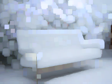
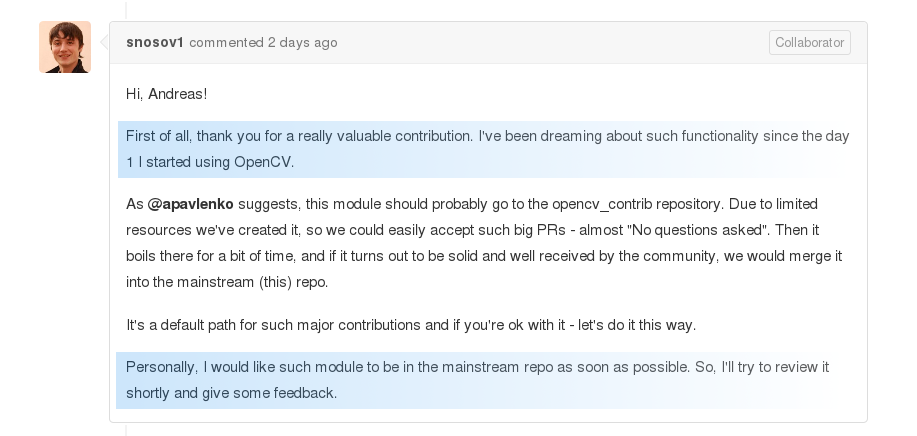
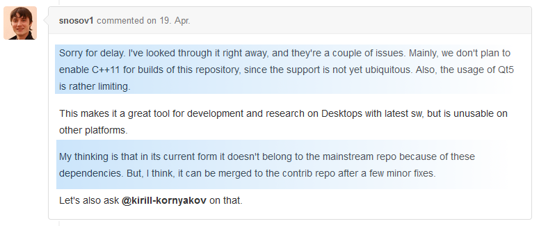
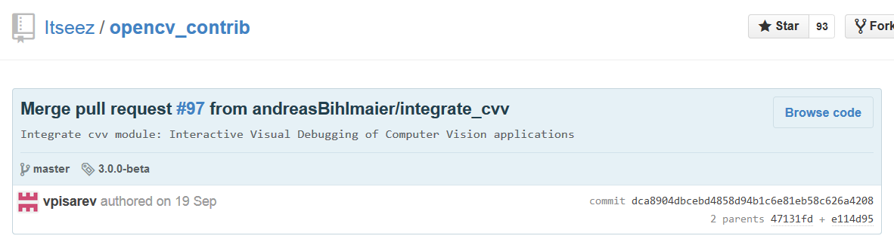

%CVVisual
%Clara; Erich; Florian; Johannes; Nikolai; Raphael
%20. Juni 2014

Gliederung
----------

- Einführung in OpenCV <!--- Clara -->
- Motivation <!--- Raphael -->
- API<!--- Florian -->
- Gui-Demo <!--- Johannes -->
- Aktueller Stand <!--- Nikolai -->

Einführung in OpenCV
====================

Überblick
---------

- Bildverarbeitung
- weite Verbreitung
- Matrizen als Grundlage
- Filter + Matches

Matrizen
--------

Bild = mehrdimensionale Matrix


<div class="notes">
Bsp. BGR-Bild: 1. Channel blau, 2. Channel grün usw.
</div>

Filter
------

Berechnung auf Umgebung jedes Pixels


Filter
------

Beispiel dilate: helle Flächen werden größer


Filter
------

Beispiel dilate: helle Flächen werden größer


Filter
------

Beispiel dilate: helle Flächen werden größer



Matches
-------

Keypoints = charakteristische Punkte


Matches
-------

Match = Paar aus Keypoints


Motivation
==========

Debuggen von OpenCV
-------------------

Systematisches Debugging statt „Random Code“


<div class="notes">
Hinweis auf showMatches/showKeypoints
</div>


<!--
Probleme
--------

* mehrere Ausgaben => Copy&Paste
* Filtern von Keypoints & Matches
* Ausblenden von Keypoints & Matches
* Ändern von Filterparametern
	* schwer reproduzierbare Ereignisse
	* lange Laufzeiten
	* => Speichern & Laden?
* Farblicher Hervorhebung
* Zoomen
* Bildfilter
* Auslesen von Pixelwerten
* Anschauen einer vorherigen Ausgabe
	* => Alle Fenster offen lassen?
-->


Ziele
-----

Visualisierung von Matritzen, Filtereffekten und Matches


API
===

Anwender API
------------

* Triviale Benutzung auch in C++98
* Sehr klein und übersichtlich


Verwendung
----------

<!---->

```cpp
std::string imgIdString = "imgRead" + toString(imgId);
cvv::showImage(imgRead, CVVISUAL_LOCATION, imgIdString);

// convert to grayscale:
cv::Mat imgGray;
cv::cvtColor(imgRead, imgGray, CV_BGR2GRAY);
cvv::debugFilter(imgRead, imgGray, CVVISUAL_LOCATION,
                 "to gray", "SingleFilterView");

cvv::finalShow(); // enables fast-forward to end
```

Demo
====


Aktueller Stand
===============

Rezeption
---------

Projekt schien von der OpenCV-Community wohlwollend aufgenommen zu werden



Rezeption
---------

Wegen C++11 und Qt5 keine Aufnahme ins Haupt-Repo...




Rezeption
---------

...aber mittlerweile in Contrib.



Links
-----

* Github: [https://github.com/CVVisualPSETeam/CVVisual/](https://github.com/CVVisualPSETeam/CVVisual/)
* Dokumentation: [https://cvv.mostlynerdless.de/](https://cvv.mostlynerdless.de/)
* Doxygen: [https://cvv.mostlynerdless.de/api/](https://cvv.mostlynerdless.de/api/)

